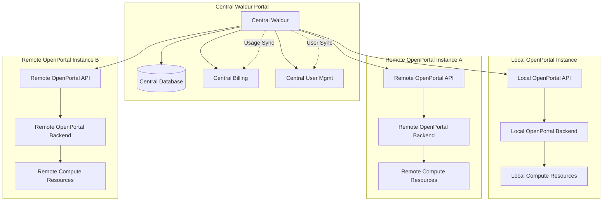
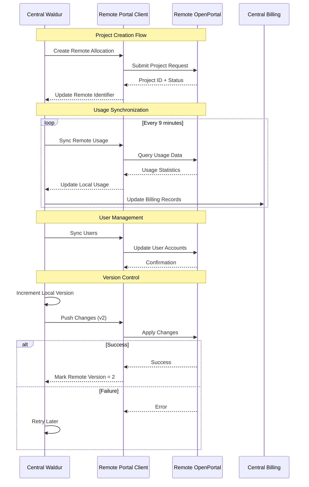
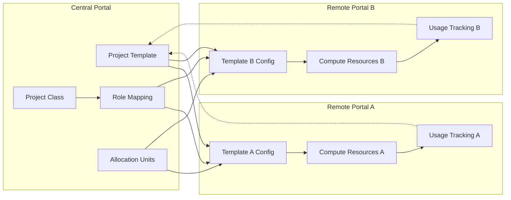
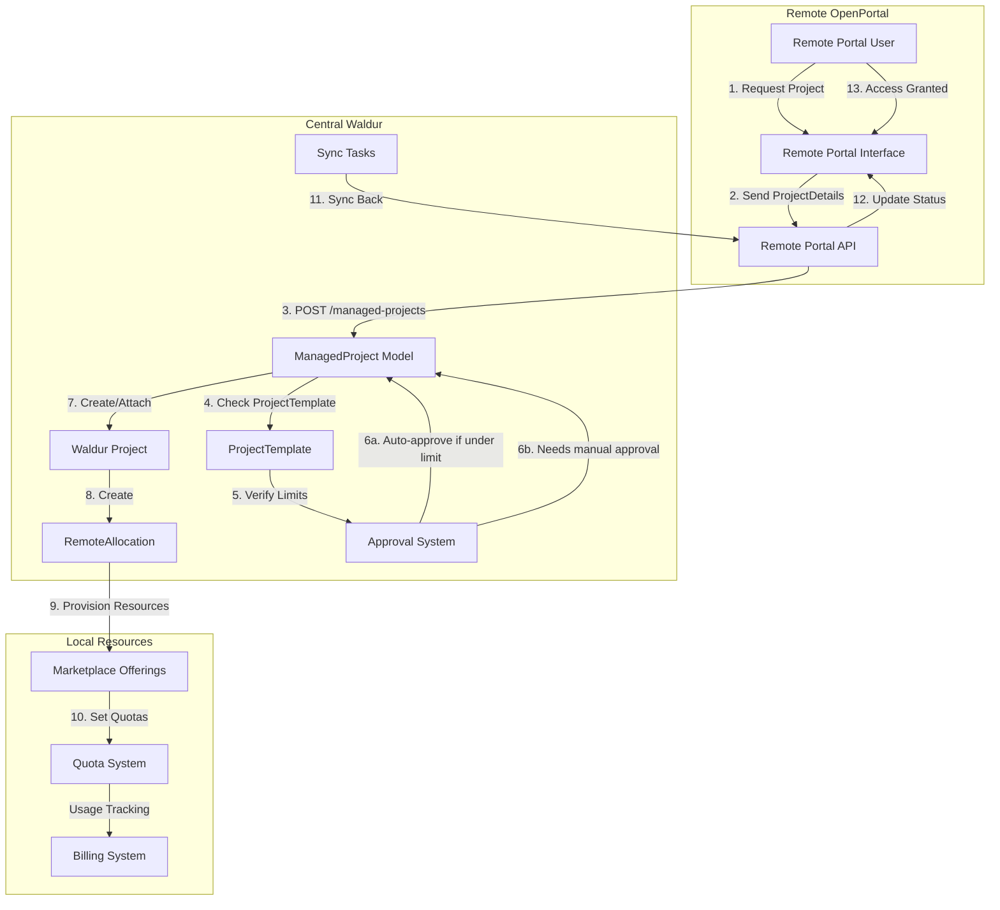
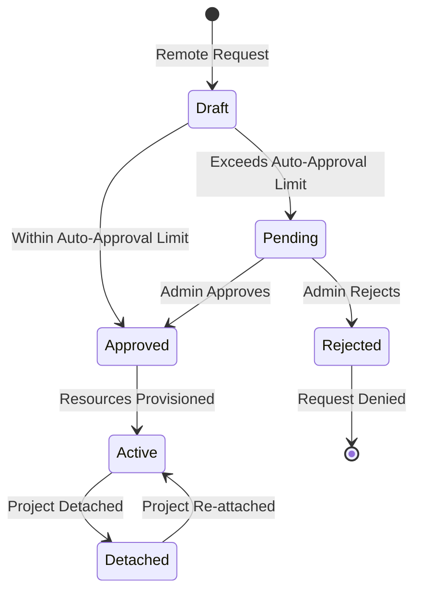

# OpenPortal Integration

The `waldur_openportal` extension provides integration with OpenPortal, a system for managing HPC/compute resource allocations. This extension enables Waldur to manage compute resources, track usage, and integrate with billing systems for HPC centers and compute providers.

## Overview

OpenPortal integration allows Waldur to:
- Manage HPC compute allocations and quotas
- Synchronize user accounts and project memberships
- Track resource usage in near real-time
- Integrate compute billing with Waldur's invoice system
- Support multi-tenant compute resource management
- Handle project approval workflows for compute access

## Architecture

### Core Components

**Models** (`waldur_openportal/models.py`):
- **Allocation** - Represents compute allocations with node limits and usage tracking
- **Association** - Links users to allocations with usernames and group memberships  
- **ManagedProject** - Projects managed through OpenPortal with approval workflows
- **ProjectTemplate** - Templates for standardized project configurations
- **RemoteAllocation** - Allocations on remote OpenPortal instances for federated setups

**Backend** (`waldur_openportal/backend.py`):
- **OpenPortalBackend** - Implements Waldur's service backend interface
- Handles resource provisioning, synchronization, and lifecycle management
- Integrates with OpenPortal's API for allocation management

**Client** (`waldur_openportal/client.py`):
- **OpenPortalRunner** - Core client for executing OpenPortal commands
- **OpenPortalClient** - High-level client interface with error handling
- Requires `OPENPORTAL_CONFIG` environment variable for configuration

### Integration Points

**Django Integration** (`waldur_openportal/apps.py`):
- Registers as a Waldur service backend
- Extensive signal handling for user/project lifecycle events
- Quota field integration for usage tracking at project and customer levels
- Permission system integration with role-based access

**Marketplace Integration**:
- Extends Waldur marketplace for compute resource offerings
- Automatic usage synchronization with billing system
- Resource lifecycle management through marketplace workflows

**Background Processing** (`waldur_openportal/tasks.py`):
Scheduled Celery tasks handle synchronization:
- `sync` - User management sync (every 59 minutes)
- `sync_usage` - Usage data sync (every 7 minutes)
- `send_notifications` - Project spend notifications (every 47 minutes)  
- `sync_remote` - Remote project sync (every 29 minutes)
- `sync_remote_usage` - Remote usage sync (every 9 minutes)

## Configuration

### Environment Setup

1. **OpenPortal Configuration**:
   ```bash
   export OPENPORTAL_CONFIG=/path/to/openportal.conf
   ```

2. **Django Settings**:
   ```python
   WALDUR_OPENPORTAL = {
       'INSTANCE_NAME': 'your-instance',
       # Additional configuration options
   }
   ```

3. **Extension Registration**:
   The extension is automatically registered via setuptools entry point:
   ```toml
   [tool.poetry.plugins.waldur_extensions]
   waldur_openportal = "waldur_openportal.extension:OpenPortalExtension"
   ```

### Service Settings

Configure OpenPortal as a service offering in Waldur:

1. Create service settings with OpenPortal backend
2. Configure connection parameters and credentials
3. Set up marketplace offerings for compute resources
4. Define quota limits and pricing models

## Usage

### Resource Management

**Creating Allocations**:
- Allocations are created through marketplace resource provisioning
- Support for node limits and usage quotas
- Automatic user/group management on compute systems
- Integration with project approval workflows

**Usage Tracking**:
- Near real-time usage synchronization from OpenPortal
- Node hour consumption tracking
- Quota enforcement and alerting
- Historical usage reporting

**User Management**:
- Automatic user account creation on compute systems
- Group membership synchronization
- SSH key management integration
- Role-based access control

### API Endpoints

**Monthly Spend Information**:
```http
GET /api/openportal/monthly_spend/?username=<username>
```
Returns project spending information for specified user.

**Resource Management**:
Standard Waldur marketplace APIs apply for:
- Creating/updating allocations
- Managing project memberships
- Viewing usage statistics
- Handling billing integration

## Quota Management

The extension adds several quota types:

**Usage Quotas**:
- `op_node_usage` - Node hours consumed
- Applied at both project and customer levels
- Updated in real-time from OpenPortal

**Resource Count Quotas**:
- `op_allocation_count` - Number of local allocations
- `op_remote_allocation_count` - Number of remote allocations
- Enforced during resource provisioning

## Remote Portal Support

The OpenPortal extension supports federated deployments where multiple OpenPortal instances are managed from a central Waldur installation. This enables organizations to manage distributed HPC resources across different sites while maintaining centralized billing, user management, and project governance.

### Architecture Overview



### Remote Allocation Model

**RemoteAllocation** (`waldur_openportal/models.py:162`):
- Extends base resource with remote-specific fields
- Tracks `remote_project_identifier` for cross-portal mapping
- Version control with `local_version` and `remote_version`
- Bidirectional synchronization support

**Key Features**:
- **Project Mapping**: Links local projects to remote project identifiers
- **Version Tracking**: Prevents conflicts during concurrent updates
- **State Synchronization**: Maintains consistency across portals
- **Usage Aggregation**: Centralizes billing from distributed resources

### Synchronization Workflow



### Remote Portal Components

**RemoteOpenPortalBackend** (`waldur_openportal/remotebackend.py`):
- Specialized backend for remote portal management
- Handles cross-portal authentication and communication
- Implements resource lifecycle for remote allocations
- Provides error handling and retry mechanisms

**RemoteOpenPortalClient** (`waldur_openportal/remoteclient.py`):
- Client interface for remote OpenPortal instances
- Project template integration for standardized deployment
- Destination management for federated routing
- Automatic portal identifier resolution

### Project Templates and Federation

**Federated Project Templates**:


**Template Configuration**:
- **Role Mapping**: Map remote roles to local permissions
- **Allocation Units**: Define resource conversion rates
- **Provider Settings**: Configure remote portal endpoints
- **Default Quotas**: Set standard resource limits per portal

### Remote Project Creation Workflow

When a project needs to be created in a remote OpenPortal instance from the Central Waldur, the process follows a sophisticated workflow through the `ManagedProject` model rather than the traditional Proposal system. Here's how it works:



#### ManagedProject Model

The `ManagedProject` model (`waldur_openportal/models.py:1825`) serves as the bridge between remote OpenPortal instances and the central Waldur system:

**Key Fields**:
- `identifier` - Unique ProjectIdentifier from the remote portal
- `details` - JSON representation of ProjectDetails from remote
- `destination` - Remote portal that manages this project
- `project` - Local Waldur Project (can be null initially)
- `project_template` - Template defining resource limits and approval rules
- `local_identifier` - Local portal's project identifier

**State Management**:
```python
# ManagedProject inherits from ReviewMixin, providing approval workflow
class ManagedProject(ReviewMixin, models.Model):
    # States: DRAFT -> PENDING -> APPROVED/REJECTED
    # Approval workflow based on ProjectTemplate limits
```

#### Project Creation Process

1. **Remote Request Arrival**:
   ```python
   # Remote portal sends ProjectDetails via API
   POST /api/openportal-managed-projects/
   {
       "identifier": "remote.portal.project123",
       "details": {
           "name": "GPU Research Project",
           "project_template": "gpu-compute",
           "allocations": [...],
           "users": [...]
       }
   }
   ```

2. **Template Resolution**:
   The system resolves the ProjectTemplate based on the remote portal and template name:
   ```python
   # ManagedProject.resolve_project_template()
   template = ProjectTemplate.objects.get(
       name=details.project_template,
       portal=remote_portal
   )
   ```

3. **Approval Decision**:
   ```python
   # ProjectTemplate.action_needs_approval()
   if template.approval_limit is None:
       # No approval needed
       auto_approve = True
   elif requested_credits > template.approval_limit:
       # Needs manual approval
       auto_approve = False
   ```

4. **Local Project Creation/Attachment**:
   - **New Project**: Creates a Waldur Project with appropriate customer and metadata
   - **Existing Project**: Attaches ManagedProject to existing Waldur Project via attach endpoint

5. **Resource Provisioning**:
   ```python
   # tasks.create_offerings_for_managed_project()
   for offering in managed_project.get_default_offerings():
       resource = marketplace_models.Resource.objects.create(
           offering=offering,
           project=project,
           limits=calculated_limits
       )
   ```

#### Approval Workflow



**Approval Limits Configuration**:
- `approval_limit` - Credits threshold requiring approval (null = no approval needed)
- `max_credit_limit` - Maximum credits allowed (null = no maximum)

**Manual Approval Process**:
```python
# Admin approves via API
POST /api/openportal-managed-projects/{identifier}/approve/
{
    "comment": "Approved for research purposes"
}

# This triggers:
# 1. State change to APPROVED
# 2. Project creation in local Waldur
# 3. RemoteAllocation creation
# 4. Sync back to remote portal
```

#### Synchronization Mechanism

The `sync_remote` task (runs every 29 minutes) handles bidirectional synchronization:

```python
@shared_task
def sync_remote():
    # Process pending ManagedProjects
    for managed_project in ManagedProject.objects.filter(
        state=ReviewStates.PENDING
    ):
        if managed_project.can_auto_approve():
            managed_project.approve()
            create_local_resources(managed_project)
            
    # Sync approved projects back to remote
    for managed_project in ManagedProject.objects.filter(
        state=ReviewStates.APPROVED,
        project__isnull=False
    ):
        sync_to_remote_portal(managed_project)
```

### Advanced Federation Features

**ManagedProject Integration**:
- Cross-portal project approval workflows
- Centralized project governance policies  
- Automated provisioning across multiple sites
- Unified project lifecycle management

**RemoteAssociation Model**:
- Links users to remote allocations
- Tracks user presence across portals
- Manages distributed group memberships
- Synchronizes user attributes and permissions

**Version Control System**:
```python
# Example version control flow
allocation = RemoteAllocation.objects.get(uuid=allocation_id)

# Local changes increment version
allocation.increment_version()  # local_version = 1, remote_version = 0

# Sync with remote portal
if allocation.needs_updating():  # True when local_version > remote_version
    success = sync_remote_allocation(allocation)
    if success:
        allocation.successfully_updated(allocation.local_version)
        # Now: local_version = 1, remote_version = 1
```

### Configuration Examples

**Service Settings for Remote Portal**:
```python
WALDUR_OPENPORTAL_REMOTE = {
    'INSTANCE_NAME': 'remote-hpc-center',
    'PROJECT_TEMPLATE': 'gpu-compute',
    'API_ENDPOINT': 'https://remote-openportal.example.com/api/',
    'AUTHENTICATION': {
        'TYPE': 'token',
        'TOKEN': 'remote-portal-auth-token'
    }
}
```

**Project Template Configuration**:
```python
# Create federated project template
template = ProjectTemplate.objects.create(
    name='distributed-compute',
    portal='central',
    allocation_units_mapping={
        'cpu_hours': 1.0,
        'gpu_hours': 0.1,  # 1 credit = 0.1 GPU hours
        'storage_gb': 100.0
    },
    role_mapping={
        'admin': {'name': 'project_admin', 'uuid': '...'},
        'member': {'name': 'project_member', 'uuid': '...'},
        'viewer': {'name': 'project_viewer', 'uuid': '...'}
    }
)
```

### Monitoring and Troubleshooting

**Remote Sync Status**:
```bash
# Check remote allocation sync status
poetry run waldur shell -c "
from waldur_openportal.models import RemoteAllocation
for ra in RemoteAllocation.objects.filter(needs_updating=True):
    print(f'{ra}: local_v{ra.local_version} -> remote_v{ra.remote_version}')
"
```

**Common Federation Issues**:
- **Version Conflicts**: Handle concurrent updates across portals
- **Network Failures**: Implement exponential backoff for retries
- **Authentication Expiry**: Refresh tokens and handle credential rotation
- **Resource Quotas**: Manage distributed quota enforcement
- **Data Consistency**: Reconcile usage data across time zones

**Monitoring Dashboards**:
- Remote portal connectivity status
- Cross-portal usage synchronization lag
- Federation error rates and retry statistics
- Distributed project approval workflows
- User account synchronization health

### Security Considerations

**Cross-Portal Authentication**:
- Secure token exchange between portals
- Certificate-based authentication for high-security environments
- Role-based access control across federated sites
- Audit logging for cross-portal operations

**Data Privacy**:
- Configurable data sharing policies per portal
- User consent management for cross-portal data
- Compliance with regional data protection regulations
- Encrypted communication between portal instances

## Project Templates

**Template System**:
- Standardized project creation workflows
- Predefined allocation configurations
- Custom approval processes
- Resource allocation mapping

**Template Configuration**:
- Define default quotas and limits  
- Set approval requirements
- Configure billing parameters
- Customize user onboarding

## Monitoring and Maintenance

### Background Tasks

Monitor Celery tasks for proper synchronization:
```bash
# Check task status
poetry run waldur celery inspect active

# Monitor task queues
poetry run waldur celery inspect reserved
```

### Logging

Configure logging for OpenPortal operations:
```python
LOGGING = {
    'loggers': {
        'waldur_openportal': {
            'handlers': ['file'],
            'level': 'INFO',
        }
    }
}
```

### Troubleshooting

**Common Issues**:
- Missing `OPENPORTAL_CONFIG` environment variable
- Network connectivity to OpenPortal API
- Permission errors during user/project sync
- Quota limit exceeded during provisioning

**Debug Steps**:
1. Verify OpenPortal configuration and connectivity
2. Check Celery task logs for sync errors
3. Review Django logs for API errors
4. Validate user permissions and project memberships

## Development

### Testing

Run OpenPortal-specific tests:
```bash
poetry run pytest src/waldur_openportal/tests/
```

### Extension Points

The extension provides several hooks for customization:
- Custom allocation backends
- Project approval workflows  
- Usage calculation methods
- Notification templates

### Database Migrations

The extension includes comprehensive migrations for:
- Core model definitions
- Quota field additions
- Remote allocation support
- Template system setup

## Security Considerations

- Secure storage of OpenPortal credentials
- API authentication and authorization
- User data synchronization privacy
- Audit logging for resource access
- Rate limiting for API calls

## Performance

### Optimization Strategies

- Background task scheduling to avoid peak usage
- Incremental synchronization to reduce data transfer
- Database indexing for common queries
- Caching of frequently accessed data

### Scaling

- Horizontal scaling through multiple Celery workers
- Database partitioning for large usage datasets  
- Load balancing for API endpoints
- Regional deployment for federated setups